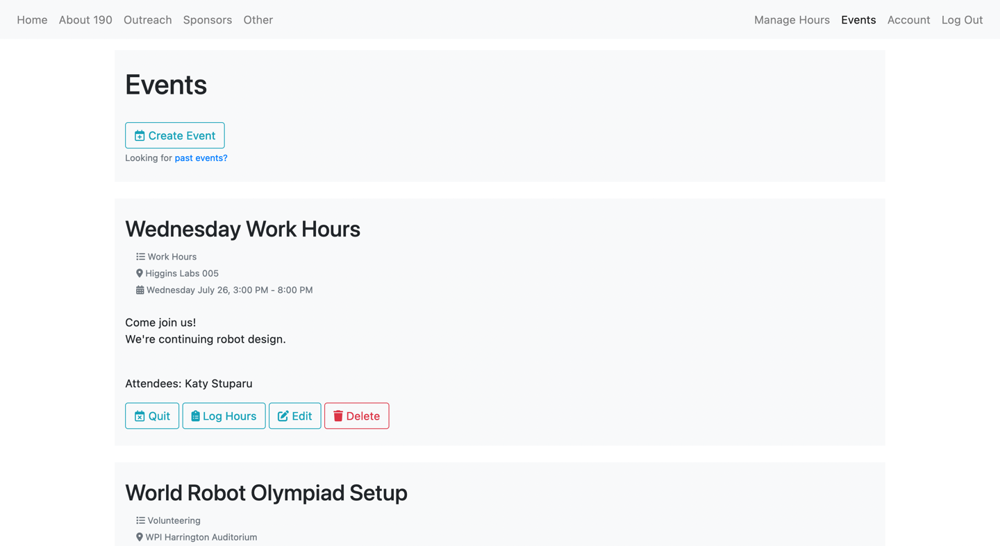
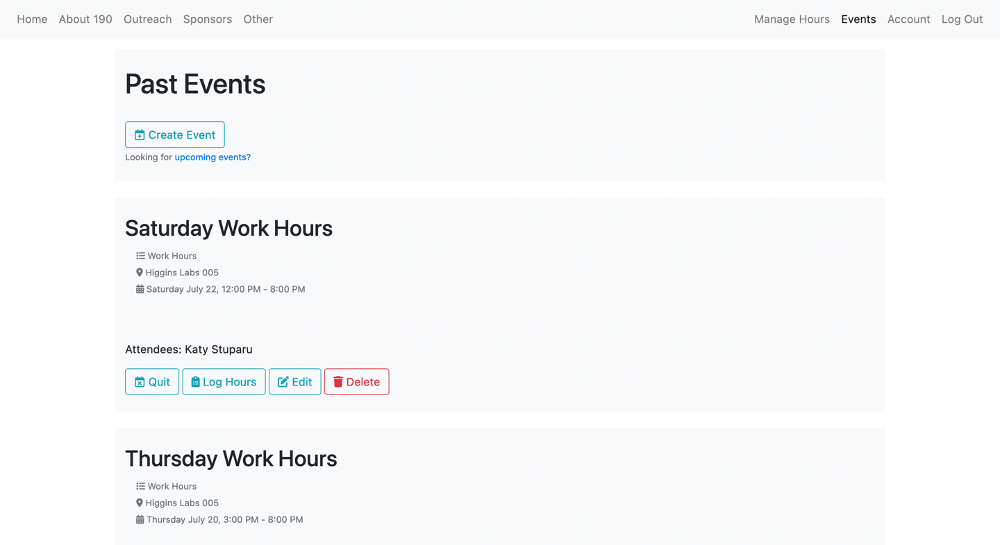
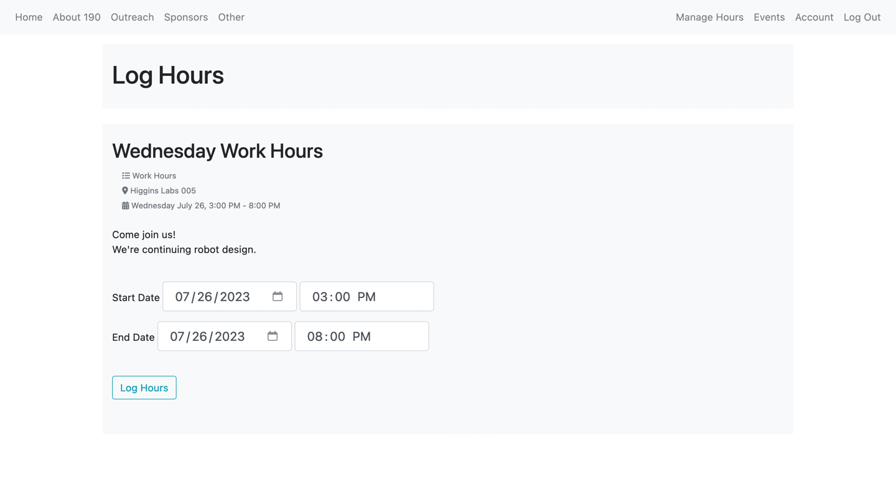
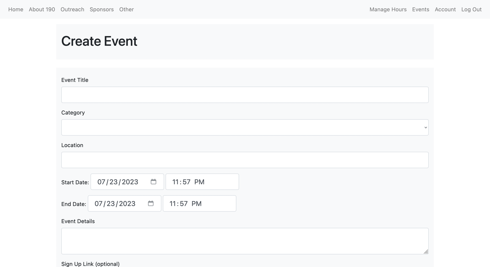
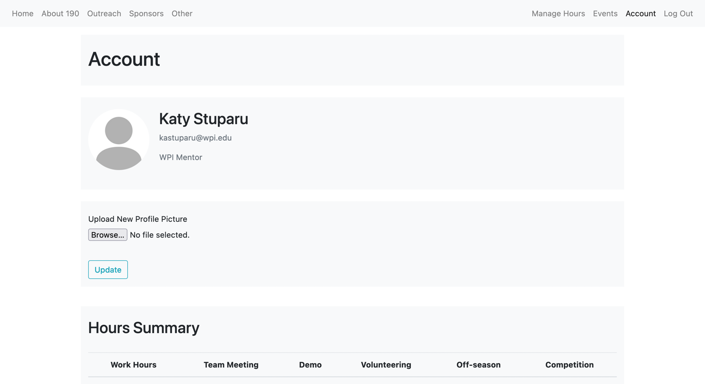
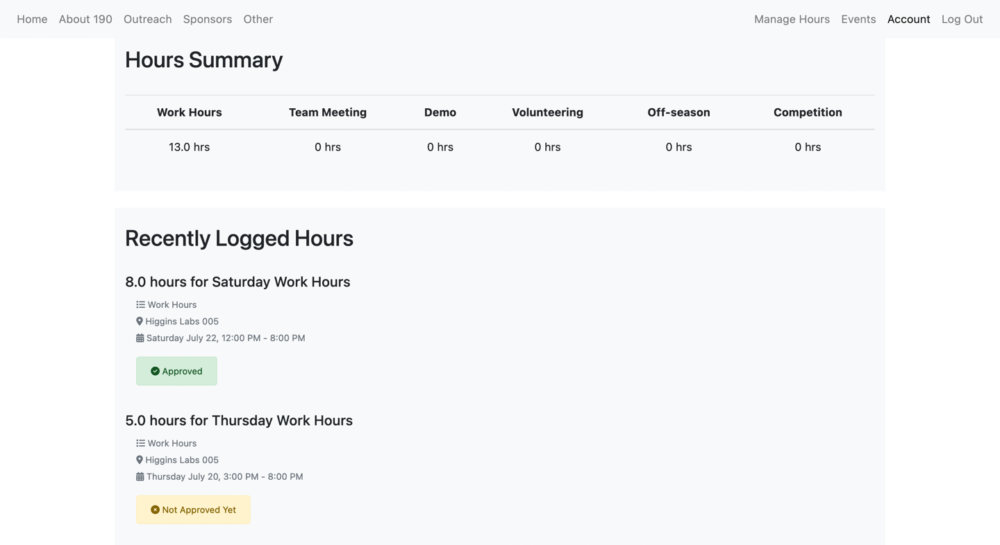
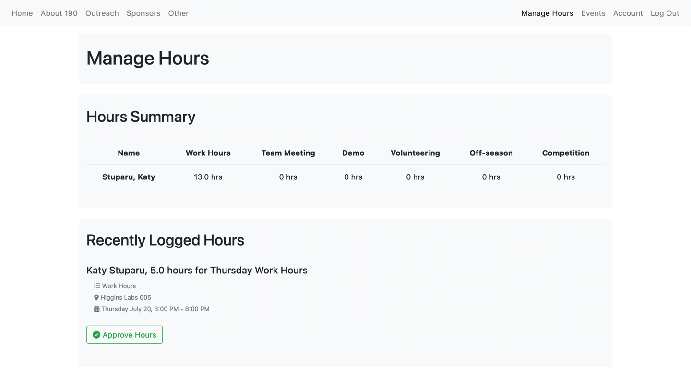

# FRC 190 Website

## Last Update: August 2022

1. View current and upcoming events. Users can sign up for events to show interest of attending. They can also log hours during or after the event occurs.
a. Events are shown in chronological order.
b. Displays category of hours (ex. work hours, demo, volunteering, off-season event, etc.), location, date and time, details, and signed up attendees.
c. Admin only: creating, editing, and deleting events.

2. View past events. Users can view events in the past and log hours if they forgot to do it earlier.
a. Admin only: creating, editing, and deleting events.

3. Log hours. During or after an event begins, users can log hours.
a. The default start and end dates/times are the event start and end dates/times. Users can change these to reflect when they were at the event. Currently, they have the flexibility to log hours outside of the event (ex. they showed up 30 minutes early or stayed 2 hours late).
b. The start and end dates/times are not stored. Only the duration is tracked.

4. Admin only: creating and editing events.
a. Category: work hours, team meeting, demo, volunteering, off-season event, competition (these can change).
b. Sign Up Link (optional): if there is a form that needs to be filled out (ex. form for off-season event).
c. When editing an event, the page comes populated with event data to be edited. Editing won’t change who is signed up or logged hours (deleting will remove logged hours, though).

5. View account information.
a. User types: Mass Academy <class year>, High School Student, WPI Mentor, Mentor (these are flexible).
b. Users can upload their own profile pictures.
c. Users can view a summary of their hours (how many hours in each category in the past year).
d. Users can view their recently logged hours, which contains hours logged within a week ago and any unapproved hours.

6. Admin only: manage hours. The admin can view a table with everyone’s hours summary for each category. The admin can also view a list of recently logged hours that need approving. Hours can be approved by the click of a button.

## Next Steps
* Add more content
* Website design and style
* Update requirements and certification tracking
* Show what percent of hours are completed

## Testing Website
A testing version of the website is running at [http://173.255.225.14](http://173.255.225.14). Please do not use this website unless it is for testing!
 
## Contact
For questions, please contact Katy Stuparu at kastuparu@wpi.edu or through a Slack channel.
